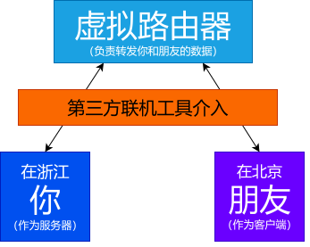

# 关于联机

:::war

联机，作为 Minecraft 中不可或缺的一部分，联机可以让你和你的朋友伙伴共同冒险同一个世界，彼此帮助，帮助对方，这不免是一种新的乐趣。

所以，我们先来认识一下，到底什么是联机？Minecraft 有几种所谓 “联机” 的方式？

## 局域网联机

:::tip

在 Minecraft 单人游戏中，你的单人世界也是以服务器的形式在运行的，所以局域网的客户端可以加入到你的世界中，这就是游戏中 “对局域网开放”

:::

这是 Minecraft 中，你和几个小伙伴最好的联机方式。得益于局域网下的设备可以互相通信的优势，它可以为同一局域网下的 Minecraft 客户端互相连接起来，这也是最简单最方便的联机方式。

他的流程图是这样的：

## 局域网联机（异域网）

:::info

以下示例图仅作为联机工具的使用，并不是任何连接技术的原理图

:::

那如果，我和我的小伙伴不在同一个网络下呢？

那么，这个时候，第三方的联机工具便应运而生，这些第三方工具可以通过各种技术手段，让他人加入到你的局域网，再使用游戏内的 `局域网联机` 来获得在同一局域网联机时的体验。

主流的第三方联机工具使用的**联机过程**有这些：

### 转发服务器 （SakuraFrp、MossFrp）

由第三方联机工具或者是内穿工具所搭建好的服务器，用来转发你和你朋友之间的数据，充当 “路由器” ，就像这样：

### 虚拟局域网 （Radmin LAN）

虚拟局域网则是将你和你的朋友拉进一个虚拟出来的路由器，能够像家里的路由器一样互相连接，就像这样：

这些都是一些常见的联机方式，按理来说也能完全适用在你的情况。

## 服务器

这是一种不大好的方式，如果你要和你的朋友游玩中大型整合包，那服务器的性能不能很差，需要大笔的资金购买服务器。我们完全可以用上面的方式进行联机。

我们也不建议萌新一上来就使用服务器作为联机方式，你需要投入大量的精力和金钱去学习开服技巧。

当你熟悉了 Minecraft 后，再来探索吧！

那么说到好的开服技巧，那一定离不开一个好的教程，那么那些腐竹哪里来的开服教程呢，那当然是 [笨蛋开服教程](https://nitwikit.8aka.cn/) 啦，这个教程覆盖了绝大多数的服务器开服教程，一定能在以后的日子里帮到你！
