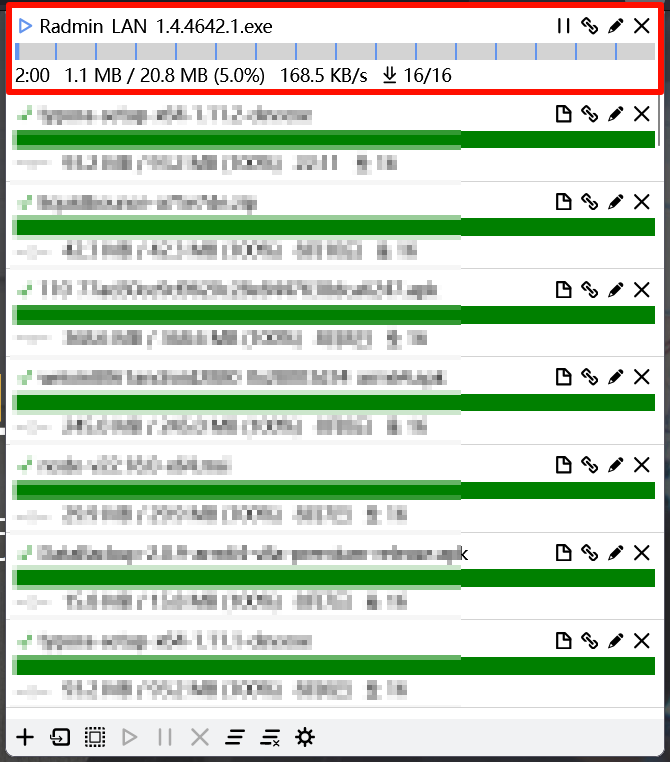
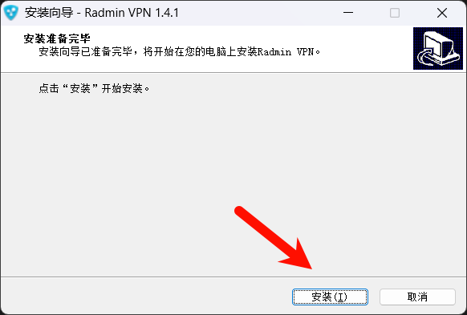
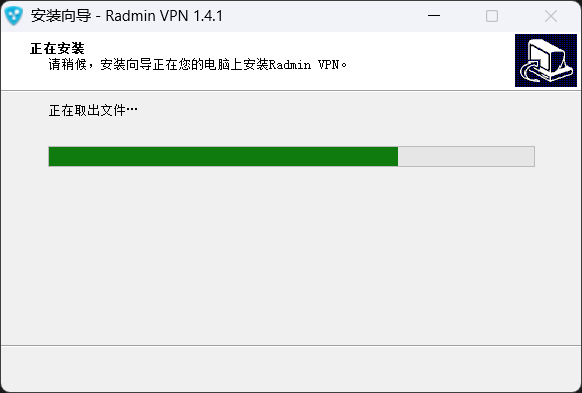
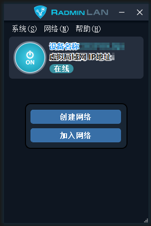

# 下载并安装 Radmin LAN

打开 **Radmin LAN 的官网**。 [点我前往](https://www.radmin-lan.cn/)

点一下下方这个大大的 **“免费下载”** 把 Radmin LAN 软件安装程序下载下来。

下载好后应该是这样的：

这是一个**软件安装程序**，但是无需我们更改任何东西，直接点击下一步就行：

稍等一小会后，**Radmin LAN** 的软件界面就会弹出来，长这样：

现在，你已经安装完成了 **Radmin LAN** 这个联机工具，接下来将会教会你如何 **创建/加入** 房间！