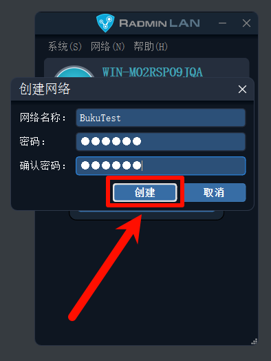
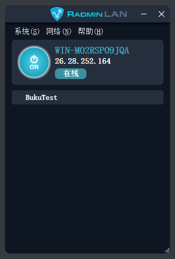
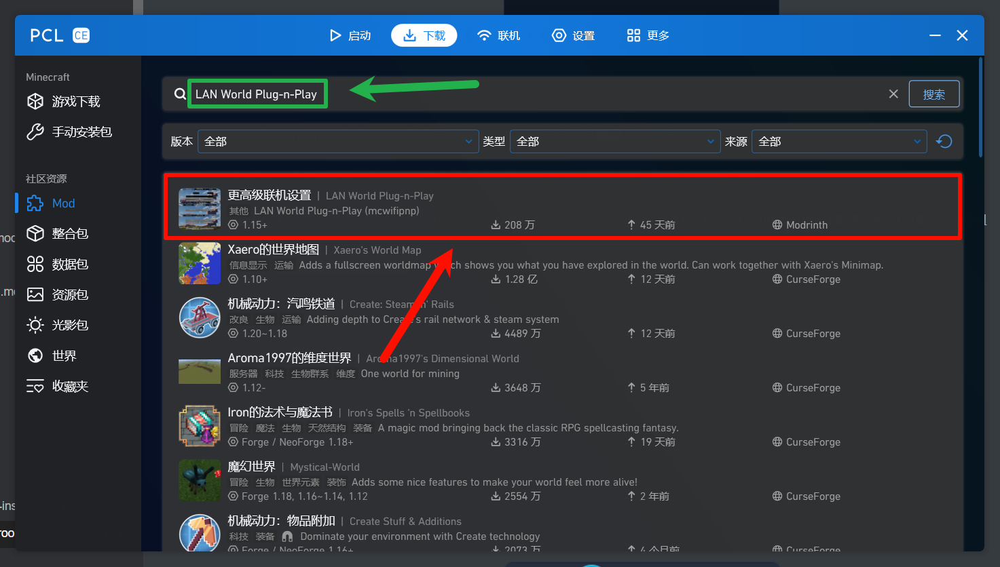
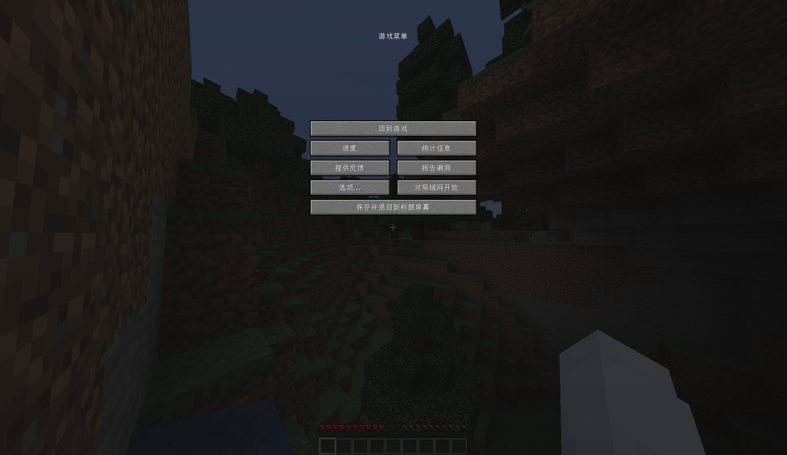
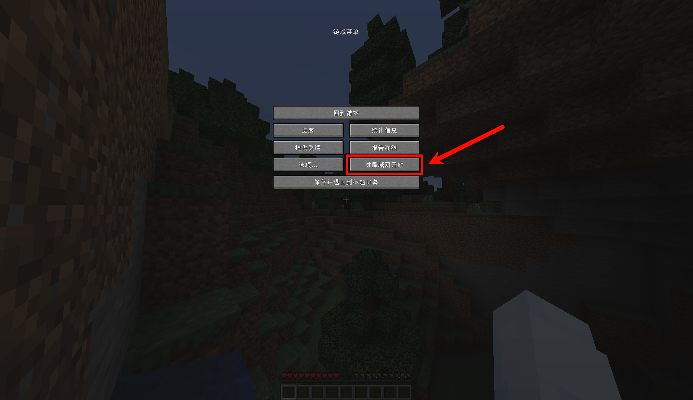
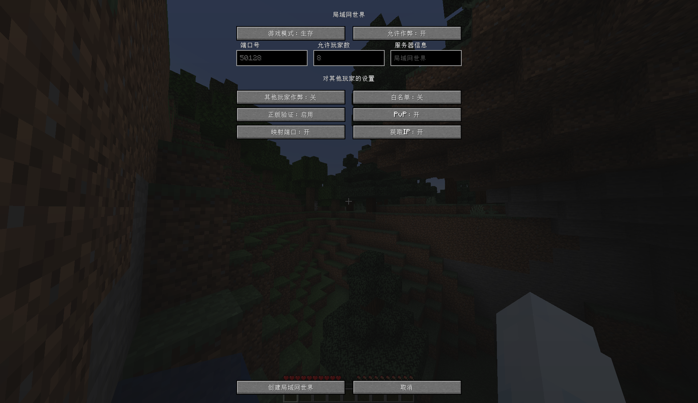
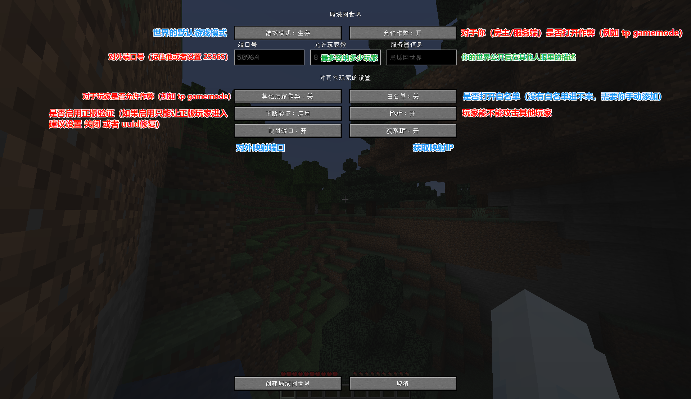
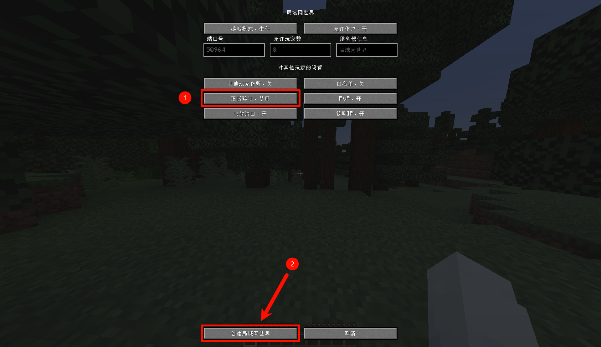
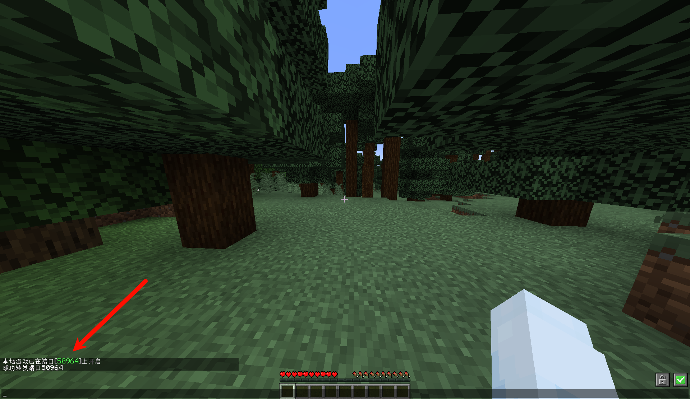

# 创建和加入网络以及游戏联机

本章将以房主视角和玩家视角进行讲解引导哈，看自己相应的部分就好喽~

:::tip

在开始看这部分之前，你需要让玩家和房主都准备好 **Radmin LAN** 这个软件哦~

如果不知道怎么下载，可以去看上一章 [下载并安装 Radmin LAN](./download-and-install-radmin-lan.md)

:::

:::tip

在这篇教程中，点击 “对局域网开放” 的人则作为 “房主” ，这个时候你的朋友则需要加入进来，你的朋友则叫做 “玩家”

房主则需要承担世界运算的工作，你可以选择让你朋友之间设备性能较好的来作为房主

:::

## 房主（服务端）

打开 **Radmin LAN**。 

在这个界面，有两个入口，分别是 **创建网络** 和 **加入网络**：

你需要创建一个网络，然后和你的朋友一起加入到同一个网络中，就可以相互联机啦~

## 创建网络

轻点 **创建网络**：

在这里你能看到一些需要填的东西：

1. **网络名称**：就是为你创建的网络去一个名字，什么都行
2. **密码和确认密码**：就是你的网络房间密码，这是进入“钥匙”的“钥匙”，你只需要告诉你的朋友就行

填好之后，点击下面的创建：

这个时候，在你的下面会多出一个你刚刚取的名字的网络：

就说明创建成功了：

:::warning

房主（服务端）需要下载一个名为 **LAN World Plug-n-Play（更高级联机设置）** 的模组来关闭 Mojang 的 **正版验证**，让你们能够一起游玩

复制 `LAN World Plug-n-Play` 到 PCL2 的模组下载页面，选择你加载器的对应版本即可

不会安装模组？不知道自己是什么模组加载器？你可以去看看 [安装模组](/PC/java/mods/install-mod)

接下来的教程将默认你已经安装了 **LAN World Plug-n-Play（更高级联机设置）** 模组

:::

创建完网络之后，打开游戏

进入你和你朋友要玩的存档

轻点 **Esc** 进入游戏菜单：

点击 **对局域网开放**：

进入设置部分：

图片里面讲述了每个设置的表示的功能，你可以参考一下，当然鼠标放上去也会有提示哦：

将正版验证设置为禁用，选择下方的创建局域网世界即可：

这个时候，聊天框应该会弹出一个关于端口消息，包含了游戏打开在 IP 的哪个端口：

点击绿色的端口号，复制下来，然后发给你朋友，你的任务就完成啦~

接下来让你朋友加进来吧~

## 玩家（客户端）

