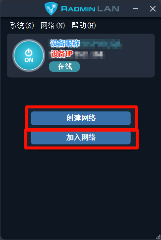
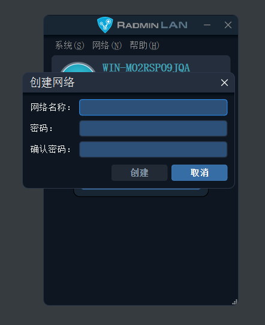

# 加入或创建网络

打开 **Radmin LAN**。 

在这个界面，有两个入口，分别是 **创建网络** 和 **加入网络**：

你需要创建一个网络，然后和你的朋友一起加入到同一个网络中，就可以相互联机啦~

## 创建网络

轻点 **创建网络**：

在这里你能看到一些需要填的东西：

1. **网络名称**：就是为你创建的网络去一个名字，什么都行
2. **密码和确认密码**：就是你的网络房间密码，这是进入“钥匙”的“钥匙”，你只需要告诉你的朋友就行

填好之后，点击下面的创建：